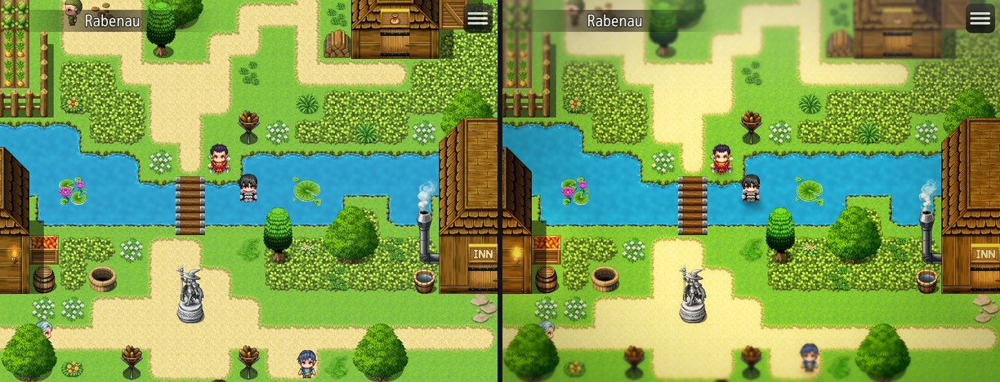
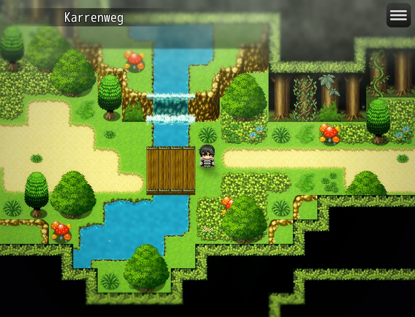
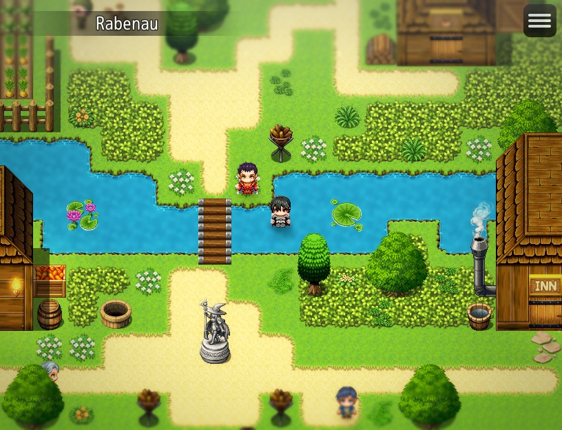
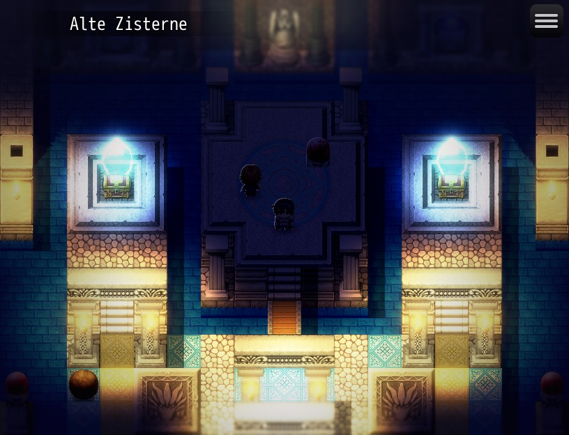
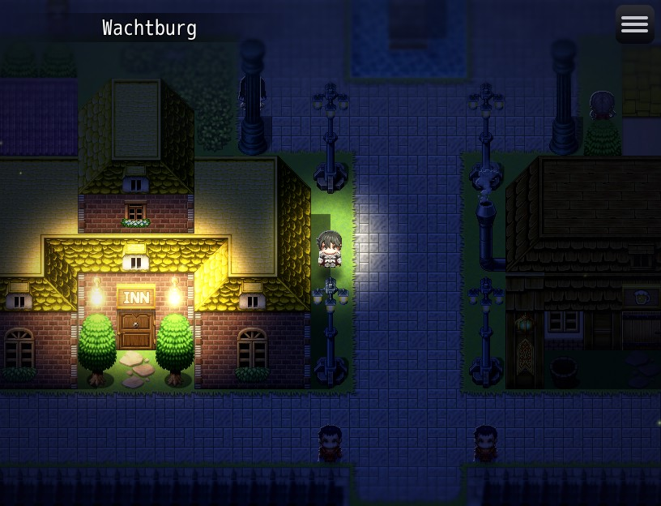

# HD2D Diorama — HD-2D style visuals for RPG Maker MZ

`HD2D_Diorama.js` makes an ordinary 2D RPG Maker MZ map look like a lit miniature
diorama seen through a camera, in the spirit of Octopath Traveler's HD-2D look.
Everything stays 2D: sprites, tilemaps and PixiJS shaders. Every object gets a
**virtual depth**, and depth drives parallax, depth of field, fog, atmospheric
perspective, lighting and (optionally) scale.

No core files are changed and there are no external libraries. A plain map
works without any setup: the default **HD2D** preset derives depth from the
screen position.



*Left: the plugin turned off. Right: the Town preset with three lamp events
tagged. The top and bottom of the screen fall out of focus (miniature/tilt-shift
look), the distance gets a light haze, and colors and contrast are graded.*

| Forest (Karrenweg) | Town (Rabenau) |
|---|---|
|  |  |
| **Dungeon (Alte Zisterne)** | **Night (Wachtburg)** |
|  |  |

These screenshots were rendered by the plugin itself on maps of the Erdenkreis
project, using exactly the configuration shown in
[Example scenes](#example-scenes).

---

## Contents

1. [Features](#features)
2. [Installation](#installation)
3. [Quick start](#quick-start)
4. [How depth works](#how-depth-works)
5. [Presets and time of day](#presets-and-time-of-day)
6. [Note tags](#note-tags)
7. [Plugin commands](#plugin-commands)
8. [Script calls](#script-calls)
9. [Parameters](#parameters)
10. [Quality and performance](#quality-and-performance)
11. [Debug tools](#debug-tools)
12. [Example scenes](#example-scenes)
13. [Compatibility](#compatibility)
14. [Setup notes for Erdenkreis](#setup-notes-for-erdenkreis)
15. [Notes on the specification](#notes-on-the-specification)
16. [Troubleshooting](#troubleshooting)
17. [How it was tested](#how-it-was-tested)

---

## Features

| System | What you get |
|---|---|
| Virtual depth | 0 (near) – 50 (focal plane) – 100 (far) for events, player, followers, vehicles, pictures, parallax layers, regions, upper-layer tiles, particles, lights and your own sprites. Automatic depth from screen Y with strength, curve, near/far depth and focal Y. |
| Parallax | Depth layers from any image (horizontal/vertical loop, scroll, offset, zoom influence, blend modes). The map's own parallax can get a depth too. |
| Depth of field | Focus depth and range, separate near/far blur and transitions, strength, radius, rack focus, auto-focus on a character. Depth-aware, so sharp characters never get blurred halos. |
| Bokeh | Bright points in blurred areas become soft discs. Intensity, size, threshold, quality and a maximum count. |
| Atmospheric perspective | Distance desaturates, flattens, lightens and cools; foreground gets more contrast and saturation. |
| 2D lighting | Point and spot lights (radius, color, intensity, falloff, softness, flicker, cone, facing direction) plus a directional sun/moon. Smooth falloff, no hard circles, HDR accumulation with a soft knee. |
| Shadows | Contact shadows, projected character silhouettes from the sun and the strongest lights, and tile shadows from walls, regions, terrain tags and events. Shadow quality Off / Low / Medium / High. |
| Ambient light | Color, intensity, temperature, shadow tint and highlight tint. |
| Fog | Three fog layers (near / mid / far) that sit at a depth, with drift, noise, color and lighting response. |
| Bloom | Threshold with soft knee, intensity, radius and quality levels. Emissive objects bloom extra. |
| Emissive | `<HD2DEmissive>` events, pictures, regions, particles and animations ignore darkness and glow. |
| Color grading | Exposure, contrast, saturation, brightness, gamma, hue, temperature, tint, shadow/highlight split toning, optional LUT and 12 grade presets. |
| Vignette | Intensity, radius, softness, color and an optional pulse. |
| Particles | Dust, motes, light, mist, fog, rain, storm, snow, ash, embers, fireflies, magic, leaves, petals and sunbeams, each with a depth range (speed, size, opacity, blur and lighting follow depth). Screen-wide or emitted at an event. MZ weather is redrawn with depth. |
| Camera | Smooth follow, zoom, pan/focus on targets, offset, shake, roll, letterbox and screen fade. Zoom works together with parallax and depth. |
| Extras | Foreground framing objects, optional depth scaling, rim lighting, optional normal maps, Pixel Perfect Mode, presets per map with cross-fades, time of day, battle support, debug overlay and depth views. |

---

## Installation

1. Copy `HD2D_Diorama.js` into your project's `js/plugins/` folder.
2. Open the **Plugin Manager**, add **HD2D_Diorama** and place it **below** every
   plugin that changes map rendering (lighting, day/night, map or sprite plugins).
3. Start a playtest. Press **F6** for the debug overlay and **F7** to cycle the
   debug views.
4. Choose a look per map with a map note tag such as `<HD2DPreset: Forest>`.

Requirements: RPG Maker MZ (built and tested with 1.7, PixiJS 5.3), WebGL 1 or
2. Half-float render targets are used for HDR lighting when available, with an
automatic 8-bit fallback.

---

## Quick start

| I want to… | Do this |
|---|---|
| …use the default look everywhere | Nothing. Every map uses the **HD2D** preset. |
| …give a map a look | Map note: `<HD2DPreset: Forest>` (or Town, Dungeon, Cave, Interior, Night, Sunset, Snow, Dream, Dark, Vanilla). |
| …make a torch glow and light the area | Event note: `<HD2DLight: 160, #ff9a40, 1.2, flicker 0.35>` and `<HD2DEmissive>` |
| …put a tree branch in the foreground | Event note: `<HD2DForeground: 12>` |
| …change the look during a cutscene | Plugin command **Set Visual Preset** with a duration, or **Set Focus Depth** for a rack focus. |
| …turn everything off on one map | Map note: `<HD2DOff>` |
| …check depth on a map | Playtest, press **F7** until the view shows *Depth* (red near, green focal, blue far). |

---

## How depth works

```
  0 ── foreground (in front of the characters, extra blur, faster parallax)
 50 ── focal / gameplay plane (sharp)
100 ── far background (blur, haze, slow parallax)
```

Depth is resolved in this order, per object:

1. A plugin command (**Set Depth**) or script call.
2. A note tag: `<HD2DDepth: 25>` on an event (note or page comment).
3. A depth region under the object (when *Character Region Depth* is on).
4. **Automatic depth**: the screen position, shaped by the preset's depth curve
   (`depth.nearDepth` at the bottom, `depth.farDepth` at the top,
   `depth.focalDepth` at `depth.focalY`, which follows the player). Upper-layer
   (star) tiles are slightly nearer (`depth.upperTileOffset`).

Tiles have no notes, so tile depth comes from **regions**: list them in the
*Region Depths* parameter or per map with `<HD2DRegionDepth: 1=20, 2=80>`.
This is how you mark foreground cliffs, bridges or distant scenery.

Depth does **not** change sprite scale unless *Perspective Scaling* is enabled
(`<HD2DEnable: perspective>` or the preset), because RPG Maker's grid
positions must stay predictable.

Default parallax factor by depth (camera movement multiplier):

| Depth | 0 | 20 | 40 | 50 | 60 | 70 | 80 | 90 | 95 | 100 |
|---|---|---|---|---|---|---|---|---|---|---|
| Factor | 1.25 | 1.15 | 1.05 | 1.00 | 0.75 | 0.57 | 0.40 | 0.25 | 0.17 | 0.10 |

---

## Presets and time of day

### Built-in presets

| Preset | Look |
|---|---|
| **HD2D** (default) | Subtle tilt-shift DOF, light haze, soft sun, gentle bloom and grading, a few dust motes. |
| Forest | Greener ambient, patchy far fog, motes, falling leaves, sunbeams. |
| Town | Bright and readable, light haze, warm grade, dust. |
| Dungeon | Dark blue-violet ambient, dense far fog, cool grade, dust. Ignores time of day. |
| Cave | Dark warm ambient, earthy fog. Ignores time of day. |
| Interior | Warm indoor light, almost no fog. Ignores time of day. |
| Night | Blue moonlight, dark ambient, stronger bloom, fireflies. |
| Sunset | Orange ambient and grade, warm fog, motes. |
| Snow | Bright cold ambient, white fog, snowfall. |
| Dream | Soft pastel grade, glow, magic sparkles. |
| Dark | Desaturated, low exposure, ash. |
| Vanilla | Every effect off (plain RPG Maker, camera features still available). |

**Custom presets** are made in the *Custom Presets* parameter. Each field left
blank inherits from the *Base* preset, so a custom preset can be as small as
"Base: Forest, Fog → Far Opacity: 0.4". A custom preset with the same name as a
built-in one replaces it. *Extra Settings* accepts any
[setting path](#setting-paths), e.g. `dof.radius=6, grade.hue=-8`.

Changing maps cross-fades between presets (*Map Transition Frames*, default 40).

### Time of day

Built-in phases: Dawn 5:30, Morning 8:00, Day 12:00, Afternoon 15:30, Sunset
18:00, Evening 19:30, Night 22:30. The current hour tints ambient light, sun,
fog, bloom, lights, grading, DOF and particles of the active preset, blending
smoothly between phases. Define your own in *Time Phases*.

| *Time Of Day Mode* | Behavior |
|---|---|
| Off (default) | Inactive until **Set Time Of Day** runs; `Set Time Of Day: Off` turns it off again. Saved with the game. |
| Manual | Active from the start at 12:00; move it with **Set Time Of Day**. |
| Variable | The hour (and optional minutes) come from variables, e.g. a day/night plugin's clock. |

Time always moves forward: going from Night to Morning passes through Dawn.
Presets marked *Uses Time Of Day: false* (Dungeon, Cave, Interior) and maps with
`<HD2DTimeOfDay: off>` ignore the clock.

---

## Note tags

Tags are case-insensitive. Options are written as `name value` and separated by
commas; their order does not matter.

### Map notes

| Tag | Meaning |
|---|---|
| `<HD2DPreset: Forest>` | Visual preset of the map. |
| `<HD2DSet: dof.radius=6, bloom.intensity=0.5>` | Override any [setting path](#setting-paths) on this map. |
| `<HD2DFocus: 55>` | DOF focus depth. |
| `<HD2DAmbient: #6070c0, 0.4>` | Ambient color and intensity. |
| `<HD2DDisable: dof, fog>` / `<HD2DEnable: perspective>` | Turn effects off / on for this map. |
| `<HD2DOff>` | No HD2D effects (and no camera zoom) on this map. |
| `<HD2DTimeOfDay: off>` | Ignore the time of day here. |
| `<HD2DZoom: 1.25>` | Camera zoom when entering the map. |
| `<HD2DRegionDepth: 1=20, 2=80>` | Region depths (added to the *Region Depths* parameter). |
| `<HD2DRegionEmissive: 7=1.5>` | Glowing regions (lava, crystals, windows). |
| `<HD2DBlockRegions: 5, 6>` / `<HD2DBlockTerrain: 3>` | Regions / terrain tags that block light. |
| `<HD2DLayer: Mountains1, depth 90, loop x, scroll 0.2 0, y -40>` | Depth parallax layer (see below). |
| `<HD2DParallaxDepth: 95>` | Give the map's own parallax a depth. It then scrolls by depth and shows through empty tiles as background. |
| `<HD2DParticles: dust, amount 30, depth 20-80>` | Screen-wide particles (see below). |
| `<HD2DNoPresetParticles>` | Do not use the preset's particles. |
| `<HD2DLight: x, y, radius, color, intensity, options>` | Static point light at tile x, y. |
| `<HD2DSpotLight: x, y, radius, color, intensity, direction, cone, options>` | Static spot light. |
| `<HD2DLightRegion: region, radius, color, intensity, options>` | A light on every tile of a region (up to 256 tiles). |

**Layer options:** `depth n`, `loop x | y | xy | none`, `scroll sx sy`
(pixels per frame), `x n`, `y n` (offset), `factor fx fy` (scroll factor,
default from depth), `opacity 0-255`, `blend normal | add | multiply | screen`,
`scale n`, `zoom 0-1` (zoom influence), `front true | false`, `folder name`
(default `parallaxes`), `id name`. Layers nearer than the focal plane are drawn
in front of the map. A file name with spaces works as the first entry or as
`image Dark Clouds`.

**Particle types:** dust, motes, light, mist, fog, rain, storm, snow, ash,
embers, fireflies, magic, leaves, petals, sunbeams.
**Particle options:** `amount n`, `depth a-b`, `color #rrggbb`, `size n`,
`speed n`, `opacity n`, `wind n`, `emissive true | false`.

### Event notes and page comments

A tag in the event **note** applies to all pages. A tag in a **Comment** on a
page applies only while that page is active, so a torch can be lit by switching
pages.

| Tag | Meaning |
|---|---|
| `<HD2DDepth: 25>` | Fixed depth (no tag = automatic). |
| `<HD2DDepthOffset: -10>` | Shift the automatic depth. |
| `<HD2DEmissive>` / `<HD2DEmissive: 1.5>` | Glows: ignores darkness and feeds bloom (0–4). |
| `<HD2DForeground>` / `<HD2DForeground: 12, parallax 1.2, scale 1.1, fade false>` | Foreground framing element (branches, rocks, pillars): drawn above the map with extra parallax and near blur; fades while it covers the player. |
| `<HD2DParallax: 1.15>` | Parallax factor for a foreground element. |
| `<HD2DScale: 1.2>` / `<HD2DNoScale>` | Manual scale / exclude from depth scaling. |
| `<HD2DLight: radius, color, intensity, options>` | Light that follows the event. |
| `<HD2DSpotLight: radius, color, intensity, direction or facing, cone, options>` | Spot light; `facing` turns with the event. |
| `<HD2DShadowCaster>` | The event blocks light on its tile (tile shadows). |
| `<HD2DShadow>` / `<HD2DNoShadow>` | Force the character shadow on / off. |
| `<HD2DRim: 0.5>` / `<HD2DNoRim>` | Rim light strength for this sprite. |
| `<HD2DNormalMap: Actor1_normal>` | Normal map file in `img/characters`. |
| `<HD2DParticles: embers, amount 8, radius 16>` | Particles emitted at the event. |
| `<HD2DSortByDepth>` | Draw by depth instead of screen Y. |

**Light options:** `falloff n` (curve, default 2), `softness 0-1` (default
0.5), `flicker 0-1`, `speed n` (flicker speed), `offsetX n`, `offsetY n`,
`shadows true | false`, `depth n` and `range n` (only light objects near that
depth), `glow 0-2` (soft additive halo), `height n` (for normal maps),
`facing true`, `coneSoftness 0-1`.

### Actor notes

The party leader's `<HD2DLight: …>` becomes a lantern carried by the player.
`<HD2DNormalMap: file>`, `<HD2DRim: n>` and `<HD2DNoShadow>` apply to whichever
character shows that actor (the player or a follower).

### Setting paths

Used by `<HD2DSet>`, **Set Visual Value**, *Extra Settings* and `HD2D.set()`.
Paths ignore case, spaces, `_` and `-` (`Bloom.Intensity` and
`depth of field.near blur` both work); unknown paths are ignored with a console
warning. Every section also has `enabled`.

| Section | Values |
|---|---|
| `depth` | focalDepth, nearDepth, farDepth, focalY, followPlayer, curve, strength, upperTileOffset, backgroundDepth, autoY |
| `parallax` | foregroundBoost, farFactor, curve, zoomInfluence |
| `dof` | focus, focusRange, nearTransition, farTransition, nearBlur, farBlur, strength, radius |
| `bokeh` | intensity, size, threshold, quality (auto/low/medium/high), maxCount |
| `atmosphere` | hazeColor, hazeAmount, farDesaturate, farContrast, farBrighten, farTemperature, nearSaturate, nearContrast, nearDarken |
| `ambient` | color, intensity, temperature, shadowTint, shadowTintAmount, highlightTint, highlightTintAmount |
| `sun` | angle, elevation, intensity, color |
| `lights` | intensity, color, dayFade, glow |
| `shadows` | opacity, length, softness, contact, lightShadows, occlusion |
| `fog` | color, lit, softness, noise, depthFog, and nearOpacity / nearDepth / nearScale / nearSpeedX / nearSpeedY (same for `mid…` and `far…`) |
| `bloom` | threshold, knee, intensity, radius, emissive |
| `grade` | exposure, contrast, saturation, brightness, gamma, hue, temperature, tint, shadowColor, shadowAmount, highlightColor, highlightAmount, lut, lutStrength |
| `vignette` | intensity, radius, softness, color, pulse, pulseSpeed |
| `rim` | color, intensity, width, angle, followSun |
| `perspective` | nearScale, farScale |

Colors are `#rrggbb` or `r,g,b` (0–255). Angles: 0 right, 90 down, 180 left,
270 up — the direction the light comes **from**.

---

## Plugin commands

Commands that change values take a **duration** (frames), most of them also an
**easing** (Linear, Smooth, Ease In, Ease Out, Ease In-Out, Sine). Optional
fields left **blank** keep their current value. Camera commands can **wait**
for completion.

| Command | Purpose |
|---|---|
| Set Visual Preset | Change the whole look with a cross-fade; optionally remember it for the map. |
| Set Time Of Day | Move the clock to a phase or hour (turns time of day on), or `Off`. |
| Set Depth / Reset Depth | Fixed depth for an event, the player, a follower, a vehicle or a picture; reset to automatic (or reset all). |
| Set Emissive | Make a character or picture glow. |
| Set Focus Depth | Rack focus to a depth. |
| Focus On Target (Auto Focus) | Keep the focus on a character's depth until turned off. |
| Set Depth Of Field | Range, near/far blur, strength, radius, transitions, on/off. |
| Set Bokeh | Intensity, size, threshold, quality, max count, on/off. |
| Set Ambient Light | Color, intensity, temperature, shadow/highlight tint. |
| Set Directional Light | Sun/moon angle, elevation, intensity, color. |
| Create Light / Remove Light | Point or spot light attached to an event, the player, a follower, a map position or a screen position; this map or all maps; saved with the game; fades in/out. |
| Enable Effect / Disable Effect | Toggle any system (Depth System, Parallax, Depth Of Field, Bokeh, Lighting, Shadows, Ambient Lighting, Bloom, Color Grading, Vignette, Fog, Particles, Normal Maps, Rim Lighting, Atmospheric Perspective, Camera Effects, Emissive, Perspective Scaling, Depth Weather, or All). |
| Set Bloom / Set Vignette / Set Fog / Set Color Grade / Set Shadows / Set Rim Light | Section values (Set Color Grade also applies grade presets and LUTs; Set Shadows also sets the shadow quality). |
| Set Visual Value / Reset Visual Values | Any setting path; reset one section or everything to the preset. |
| Set Camera Zoom | Zoom the world (pictures and windows stay). |
| Set Camera Focus (Pan) | Pan to and follow the player, an event or a map position, or hold the current position. |
| Camera Offset / Camera Shake / Camera Rotation | Framing offset, smooth 2D shake, camera roll. |
| Smooth Camera | Easing on / off / default. |
| Letterbox / Screen Fade | Cinematic bars; fade the map (not windows) to a color. |
| Set Parallax Layer / Remove Parallax Layer | Depth layers at runtime (this map or all maps). |
| Set Particles / Remove Particles | Emitters at runtime, screen-wide or at an event. |
| Set Quality | Change the quality level (e.g. from an options event). |
| Debug View | Show the overlay or a debug view from an event. |

RPG Maker's own **Scroll Map** command works as usual: the HD2D camera holds
the scrolled position until the player moves or a camera command runs.

---

## Script calls

```js
HD2D.setPreset("Night", 120);                 // preset, duration, easing
HD2D.set("dof.focus", 70, 60);                // any setting path
HD2D.get("bloom.intensity");
HD2D.reset("dof", 30);                        // back to the preset ("all" for everything)
HD2D.setEffect("bloom", false);
HD2D.setQuality("High");                      // "Low", "Medium", "High", "Ultra", "" = parameter
HD2D.setShadowQuality("Low");                 // "Off", "Low", "Medium", "High", "Auto"
HD2D.setTime(18.5, 600);                      // hour, duration; HD2D.setTime("off")
HD2D.Camera.setZoom(1.5, 60, "Smooth");
HD2D.addLight({ id: "a", attach: "player", radius: 200, intensity: 1, color: [1, 0.8, 0.6] });
HD2D.removeLight("a", 30);
HD2D.registerSprite(mySprite, { depth: 30, emissive: 1 });
```

`registerSprite` gives a plugin-created sprite a depth and emissive strength.
Add the sprite to the map's tilemap
(`SceneManager._scene._spriteset._tilemap.addChild(mySprite)`) so that it is
sorted with the characters, blurred by depth and lit like the map.

---

## Parameters

| Group | Parameters |
|---|---|
| General | Default Preset, Quality, Adaptive Quality, Shadow Quality, Effects (one switch per system), Pixel Perfect Mode (+ Round Pixels), Map Transition Frames, Keep Overrides On Transfer, Post FX On Pictures, TausiLighting Compatibility |
| Depth | Region Depths, Region Emissive, Character Region Depth, Sort Characters By Depth |
| Lighting | Light Blocking Regions, Light Blocking Terrain Tags, Wall Tiles Block Light, Object Characters Cast Shadows, Animations Unlit, Light Height, Normal Map Suffix, Auto-Detect Normal Maps |
| Camera | Smooth Camera, Camera Follow Speed, Min Zoom, Max Zoom, Rotation Overscan, Zoom DOF Influence |
| Particles | Particle Density |
| Time Of Day | Time Of Day Mode, Hour Variable, Minute Variable, Time Phases |
| Presets | Custom Presets |
| Battle | Battle Effects, Battle Preset, Battle Background Blur |
| Debug | Debug Mode (Off / Playtest / Always), Debug Overlay Key, Debug View Key |

Every parameter has a description in the Plugin Manager.

---

## Quality and performance

| Level | Light buffer | DOF | Bokeh | Shadows | Bloom | Fog layers | Max lights | Particles |
|---|---|---|---|---|---|---|---|---|
| Low | ¼ resolution | 12 taps | kernel only | contact | 2 levels | 1 | 8 | ×0.4 |
| Medium *(default)* | ½ | 20 taps | light discs | + sun / light silhouettes | 3 | 2 | 16 | ×0.7 |
| High | ½ | 32 taps | disc sprites | + tile shadows, normal maps | 4 | 3 | 24 | ×1 |
| Ultra | full | 48 taps | more discs | longer shadow rays, 2 light silhouettes | 5 | 3 | 32 | ×1.5 |

Measured at 816×624 on the Erdenkreis town map (night, 6 lights):

| Level | Render passes per frame | Render-texture memory | Plugin CPU time per frame |
|---|---|---|---|
| Low | 15 | 4 MB | ~0.6 ms |
| Medium | 20 | 11 MB | ~0.6 ms |
| High | 22 | 11 MB | ~0.5 ms |
| Ultra | 24 | 14 MB | ~0.5 ms |

GPU cost depends on the device. Low and Medium are meant for integrated and
mobile GPUs, High for dedicated GPUs, and Ultra only when chosen explicitly.

- **Shadow Quality** (parameter, Set Shadows command or
  `HD2D.setShadowQuality`) overrides only the shadow part of the level:
  Off = none, Low = contact shadows, Medium = + silhouettes, High = + tile
  shadows.
- **Adaptive Quality** steps down one level when the frame rate stays below
  50 FPS.
- **Effects** switches and the Enable/Disable Effect commands turn off single
  systems, which helps you find performance bottlenecks.
- Render textures are shared between scenes, so opening menus or changing
  maps does not reallocate GPU memory, and the light shader is compiled while
  the map loads so the first light does not cause a stutter.

---

## Debug tools

With *Debug Mode* = Playtest (default) or Always:

- **F6** toggles the overlay: version, quality, HDR/LDR, shadow quality, FPS,
  frame time, render passes, preset and transition, time of day, focus depth,
  focal plane, player depth and blur, camera zoom/rotation, light count,
  particle count, active and inactive effects, and render textures (count and
  MB). Light sources are drawn as gizmos.
- **F7** cycles the views: **Depth** (red = near, green = focal plane, blue =
  far), **Blur** (circle of confusion), **Lighting** (light buffer),
  **Objects** (which pixels belong to sprites, tiles and emissive objects),
  **Bloom**, and Off.
- The **Debug View** command shows the same from an event.

---

## Example scenes

The screenshots at the top of this page show these four setups. Each is an
ordinary map with nothing but the tags below. The event tags are put on the
existing lamp, torch and crystal events (`!Flame`, `!Crystal` graphics).

### Forest — Karrenweg

```
Map note:
<HD2DPreset: Forest>
```

The Forest preset alone gives the green ambient light, patchy far fog,
drifting motes, falling leaves and sunbeams. Useful additions:

```
<HD2DLayer: Forest, depth 92, loop x, y -120>     far tree line, visible through unpainted map cells
<HD2DRegionDepth: 3=22>                            region 3 painted on near cliffs/trees
```

Foreground framing: an event with a tree or branch graphic, priority *Above
characters*, at the bottom edge of the map, with this event note:

```
<HD2DForeground: 12, parallax 1.25>
```

### Town — Rabenau (day)

```
Map note:
<HD2DPreset: Town>

Lamp / brazier events (event note):
<HD2DLight: 170, #ffb060, 1.2, flicker 0.15>
<HD2DEmissive: 1.2>
```

Lamps are faded in daylight (`lights.dayFade`) and become strong at dusk.
Characters cast contact and sun shadows; a light haze and a soft focus
fall-off at the top and bottom of the screen give the miniature look.

### Dungeon — Alte Zisterne (High quality, wall shadows)

```
Parameters: Quality = High, Wall Tiles Block Light = ON

Map note:
<HD2DPreset: Dungeon>
<HD2DSet: shadows.occlusion=0.9>

Torch events:
<HD2DLight: 180, #ff9a40, 1.4, flicker 0.35>
<HD2DEmissive: 1.3>

Crystal events:
<HD2DLight: 120, #7fc8ff, 1.0>
<HD2DEmissive: 1.6>
```

Walls stop the torch light. Wall tops and roofs are solid; wall sides are the
visible face of a wall, lit by lights in front of them. A torch placed on a
wall face lights the floor in front of and beside that wall. Without wall
tiles, paint light-blocking regions and list them with
`<HD2DBlockRegions: 5>`.

### Night — Wachtburg

```
Map note:
<HD2DPreset: Night>

Lamp events:
<HD2DLight: 170, #ffb060, 1.2, flicker 0.15>
<HD2DEmissive: 1.2>

Actor note of the party leader (a lantern):
<HD2DLight: 120, #ffd9a0, 0.7, offsetY -6>
```

Moonlight comes from the Night preset (blue ambient, low directional light,
fireflies). For a whole day cycle instead of a fixed night, use
[time of day](#time-of-day) with the Town preset.

### A custom preset

In *Custom Presets* add an entry with:

- **Name**: `Harbor`
- **Base**: `Town`
- **Fog** → Far Opacity `0.25`, Color `#c8d8e8`
- **Particles**: `mist`, Amount `6`
- **Particle Mode**: `Add`
- **Extra Settings**: `grade.temperature=-0.04, bloom.intensity=0.45`

Then use `<HD2DPreset: Harbor>` on a map.

---

## Compatibility

- **No core edits.** Everything is done with aliases. Works with maps, events,
  the player, followers, vehicles, pictures, MV and Effekseer animations,
  weather, the menu, save/load and battles.
- **Pictures** stay untouched screen-space UI by default. Give a picture a
  depth (Set Depth → Picture) to move it into the world, or enable *Post FX On
  Pictures* to grade them too. Windows are never affected.
- **Battles** are not maps, so they get color grading, bloom, vignette and a
  depth blur on the battlebacks (the backdrop fully, the floor slightly). Use
  *Battle Preset* for a specific look.
- **TausiLighting**: with *TausiLighting Compatibility* = Auto (default), HD2D
  turns its own ambient, sun and point lights off on maps that have Tausi
  lights. Contact shadows, DOF, fog, bloom and grading still apply. Tausi does
  not know about camera zoom, so keep the zoom at 1 on Tausi-lit maps.
- **Day/night and tint plugins** (e.g. McKathlin_DayNight): the screen tone is
  applied before HD2D lights the scene, so a dark tint and a dark HD2D preset
  stack ("double darkening") and lamps cannot restore the colors. Prefer
  letting HD2D draw the night (see the next section). Clock plugins may
  protect their variables; change the time with their own commands.
- **Graceful degradation**: if a device cannot run a pass or an unexpected
  error occurs, HD2D logs it and turns itself off for that map (the camera
  returns to zoom 1 until the next map) instead of stopping the game. Without
  half-float textures, lighting falls back to 8-bit. WebGL 1 is supported.
- **Pixel Perfect Mode** (default on) uses nearest-neighbour filtering for map
  art, rounds sprite positions and snaps the camera to whole pixels. Blur,
  bloom and fog are smooth by nature; the sharp parts of the image stay
  pixel-exact.

---

## Setup notes for Erdenkreis

The project in this repository already uses Rank_*, McKathlin_DayNight,
TausiLighting, WD_Quest and Story_Core. All of them were run together with
HD2D (see [How it was tested](#how-it-was-tested)). Recommended setup:

1. **Order**: put HD2D_Diorama at the bottom of the plugin list.
2. **TausiLighting**: keep *TausiLighting Compatibility* = Auto. Tausi-lit maps
   (e.g. Erwachenshöhle, Zum Schwarzen Raben) keep Tausi's lighting; all
   other maps use HD2D lighting.
3. **Day and night**: let McKathlin keep the clock and HD2D draw the light.
   - HD2D: *Time Of Day Mode* = Variable, *Hour Variable* = 5, *Minute
     Variable* = 6 (McKathlin's "Current Hour/Minute Variable").
   - McKathlin: set the Dawn/Dusk tone phases and the Night tone to 0, 0, 0, 0
     so the screen is not tinted twice. Its switches, variables and step clock
     keep working, and its **Set Time** command now also changes the HD2D
     look.
   - Interior maps: use `<HD2DPreset: Interior>` (or Cave/Dungeon), which
     ignore the clock, matching McKathlin's lighting tags.
4. **Presets per map**: for example Forest for Kiefernwald and Karrenweg, Town
   for Rabenau, Eisfurt and Wachtburg, Cave for Erwachenshöhle and
   Eisfallhöhle, Dungeon for Kornspeicher-Gewölbe and Alte Zisterne, Snow for
   Hochweg, and Interior for houses and inns.
5. **Lamps**: tag the `!Flame` events with the lamp tags from
   [Example scenes](#example-scenes).

---

## Notes on the specification

The specification was implemented in full. A few points were technically
unsound or ambiguous as written; this is how they were resolved:

1. **Depth scale.** Both suggested scales were possible; **0 = near, 50 =
   focal, 100 = far** was chosen because it needs no negative numbers in
   note tags and maps directly onto the editor's number fields.
2. **Foreground parallax.** The example table gives the foreground the same
   factor as the gameplay layer (1.00x). Something nearer to the camera than
   the focal plane must move *faster* than the map, otherwise it reads as
   painted on the ground. HD2D uses factors above 1 in front of the focal
   plane (1.15x at depth 20) and reproduces the table behind it (≈0.75x at
   60, 0.40x at 80, 0.17x at 95).
3. **Depth of field must be object-aware, not a fullscreen shader.** Per-sprite
   blur filters, the obvious way to do this, are slow (one render target per
   sprite, no batching) and wrong at edges (a blurred foreground object must
   spill over the sharp scene behind it). HD2D renders each object's depth
   into a small depth buffer and blurs with a depth-aware gather in one pass.
   That gives the per-object result (tree 20 = blurred, player 50 = sharp,
   house 70 = medium, mountains 100 = strong) at a fixed cost.
4. **Bokeh "maximum count".** Bokeh shape always comes from the blur kernel; the
   maximum count limits the extra highlight discs, which are drawn from Medium
   quality up (or with Bokeh quality set to Medium/High).
5. **Shadow casting.** True dynamic shadows for every sprite and light would
   need a shadow map per light, which is too expensive in PixiJS. As the spec
   allows, HD2D combines contact shadows, projected character silhouettes (sun
   and strongest lights) and tile shadows (a ray march over a per-tile blocker
   map built from regions, terrain tags, walls and `<HD2DShadowCaster>`
   events). RPG Maker walls are drawn as a top plus a camera-facing side, so
   sides are lit from the front instead of shadowing themselves.
6. **Emissive animations.** Effekseer animations cannot be tagged per
   particle, so all animations are drawn unlit (*Animations Unlit*): they are
   not darkened by night or dungeon ambient light and they feed bloom.
7. **Atmospheric "opacity".** Making distant world pixels transparent would
   only reveal the black canvas, so distance fades towards the haze color
   instead.
8. **Normal maps** cannot be derived from pixel art automatically. They are
   optional files (`Actor1_normal.png`, OpenGL style: green = up) at
   High/Ultra; sprites without one are lit normally.
9. **Tile depth.** RPG Maker tiles have no notes, so tiles get depth from the
   screen position, the upper-layer offset and regions.
10. **Bloom "quality"** is the number of blur levels, tied to the quality
    level (2–5).
11. **Camera zoom and the UI.** Zoom, rotation and shake apply to the world
    only; pictures and windows keep their positions. Zooming out enlarges the
    tilemap so no edges show (*Min Zoom* / *Max Zoom* limit the range).

---

## Troubleshooting

| Symptom | Fix |
|---|---|
| Everything is too blurry | Lower `dof.radius` or `dof.farBlur` (`<HD2DSet: dof.radius=3>`), or raise `dof.focusRange`. |
| The map looks washed out | Lower `atmosphere.hazeAmount`, `atmosphere.farDesaturate` or `fog.farOpacity`. |
| Night is too dark / lamps look dull | Check for a second tint (screen tone or a day/night plugin) and set it to neutral. |
| A translucent overlay blurs the whole screen | Pictures and layers below 40% opacity do not write depth; give opaque overlays a depth or keep them as screen pictures. |
| Lights pass through walls | Use High quality and turn on *Wall Tiles Block Light* or list blocking regions. |
| A normal map is ignored | It must have the same size as the sheet and the quality must be High/Ultra. |
| Low frame rate | Use Medium or Low, set *Shadow Quality* to Low, or enable *Adaptive Quality*. Use F6/F7 to see which passes run. |
| Something renders wrongly next to another plugin | Move HD2D to the bottom of the plugin list, then disable effects one by one with Disable Effect to find the conflict. |

---

## How it was tested

The plugin was run headless in Chromium (SwiftShader WebGL 1 and 2) on the
Erdenkreis project with RPG Maker MZ 1.7:

- all 37 plugin commands with the editor's default arguments, every option of
  every select argument (313 calls) and semantic checks of their effects;
- map transfers with preset cross-fades, menu, battle, save/load
  (persistence of presets, lights, zoom and overrides), Effekseer
  animations, weather, Scroll Map;
- the complete plugin list of the game (Rank_Core, Rank_Battle, Rank_Menus,
  Rank_Maps, McKathlin_DayNight, TausiLighting, WD_Core, WD_Quest,
  Story_Core) including the TausiLighting hand-off and the McKathlin clock;
- every quality level, shadow quality, normal maps, wall/region shadows,
  WebGL 1 and the 8-bit (no half-float) fallback, all producing the same
  image within rounding;
- CPU profiling of the update and render code.

The test runner and the main scenarios are in [`test/`](test/README.md) so
the checks can be repeated after changes.
